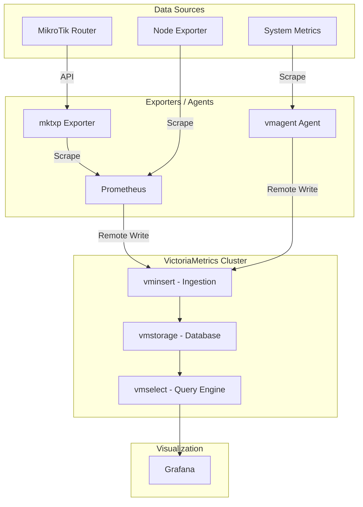

# Monitoring Stack

A comprehensive monitoring solution utilizing **VictoriaMetrics** for high-performance time-series storage, **Prometheus** for scraping, **Grafana** for visualization, and specialized exporters like **MKTXP** for MikroTik devices.

## 🏗️ Architecture & Data Flow

This stack is designed as a distributed monitoring system. It supports both Docker-based local development and production-ready Kubernetes deployments.

### Data Flow Diagram



---

## 🚀 Components

### 1. VictoriaMetrics Cluster
The backbone of the storage layer, split into three functional parts:
*   **vmstorage**: Stores the raw data and keeps track of the metadata. Configured for replication (factor 2) in this stack.
*   **vminsert**: Proxies the incoming data to `vmstorage` nodes using a hashing algorithm.
*   **vmselect**: Fetches data from `vmstorage` nodes to serve queries from Grafana.

### 2. Prometheus
Acting as the primary scraper, Prometheus:
*   Scrapes itself for health monitoring.
*   Scrapes **MKTXP** for MikroTik metrics.
*   Uses `remote_write` to push all collected metrics to the VictoriaMetrics `vminsert` endpoint.

### 3. MKTXP (MikroTik Exporter)
A specialized exporter that connects to MikroTik routers via WinBox/API ports to retrieve interface statistics, system health, and wireless metrics.

### 4. Grafana
Pre-configured with:
*   **VictoriaMetrics** as the default datasource.
*   **Provisioned Dashboards**: "Node Exporter Full" for system health and "VictoriaMetrics - cluster" for monitoring the storage itself.

### 5. vmagent (Standalone Agent)
A lightweight alternative or supplement to Prometheus, used here primarily for macOS monitoring via a bash installer.

---

## 🛠️ Deployment Options

### Option A: Docker Compose (Local/Single Node)
To spin up the entire stack using Docker:

```bash
cd docker
docker-compose up -d
```

**Services:**
*   Grafana: [http://localhost:3000](http://localhost:3000)
*   VictoriaMetrics Select: [http://localhost:8481](http://localhost:8481)
*   Prometheus: [http://localhost:9090](http://localhost:9090)
*   MKTXP: [http://localhost:49090](http://localhost:49090)

### Option B: Kubernetes (Cluster Deployment)
Apply the manifests in order:

1.  **VictoriaMetrics Storage**: `kubectl apply -f k8s/victoria-metrics/`
2.  **MKTXP Credentials**: Edit `k8s/mktxp/secret.yaml` then `kubectl apply -f k8s/mktxp/`
3.  **Prometheus**: `kubectl apply -f k8s/prometheus/`
4.  **Grafana**: `kubectl apply -f k8s/grafana/`
5.  **Portainer (Optional)**: `kubectl apply -f k8s/portainer/`

---

## 🖱️ Local macOS Monitoring (vmagent)

A helper script is provided to monitor your local Mac and send data to the VictoriaMetrics cluster.

```bash
cd vmagent
chmod +x install.sh
./install.sh
```
This script downloads `vmagent`, starts `node_exporter` via Homebrew, and begins pushing metrics to `localhost:8480`.

---

## 📋 Port Reference Table

| Component | Port | Description |
| :--- | :--- | :--- |
| **Grafana** | 3000 | Dashboard UI |
| **VictoriaMetrics Insert** | 8480 | Data Ingestion (Prometheus Remote Write) |
| **VictoriaMetrics Select** | 8481 | Query API (Grafana Datasource) |
| **VictoriaMetrics Storage** | 8482 | Storage Health/UI |
| **Prometheus** | 9090 | Scraper UI |
| **MKTXP** | 49090 | MikroTik Metrics Endpoint |
| **vmagent** | 8429 | Agent Health/UI |
| **Portainer** | 9000 | Container Management (K8s) |

---

## ⚙️ Configuration Files
*   `docker/prometheus/prometheus.yml`: Scrape jobs and remote write URL.
*   `docker/mktxp/mktxp.conf`: MikroTik connection details.
*   `k8s/mktxp/secret.yaml`: Kubernetes secrets for router credentials.
*   `vmagent/vmagent-conf.yml`: Local scrape configuration for `node_exporter`.
