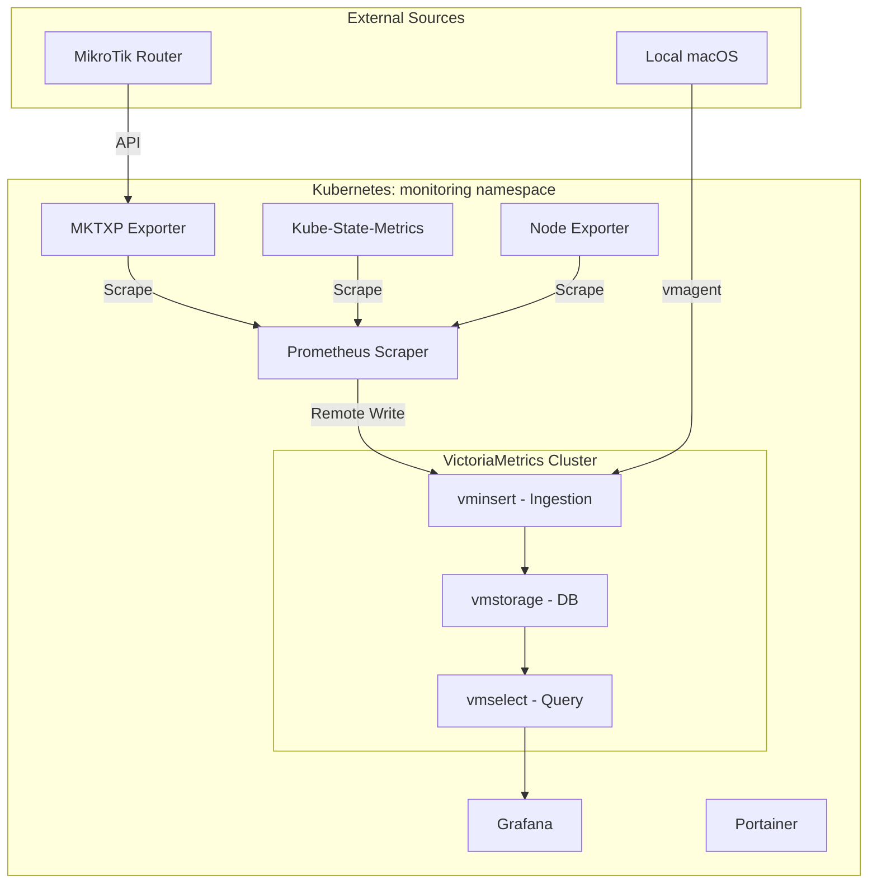
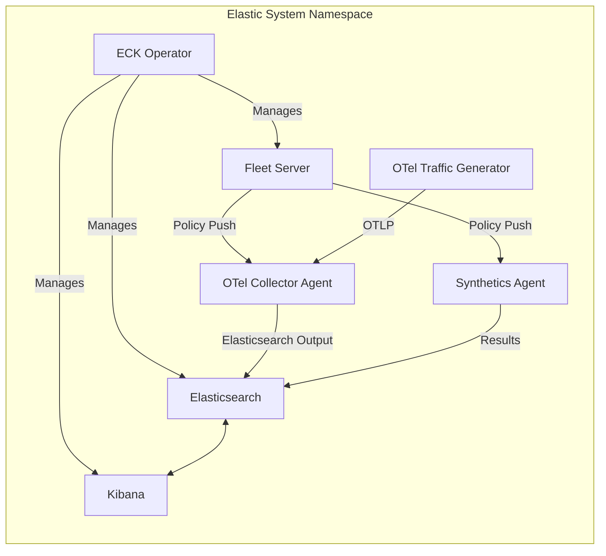
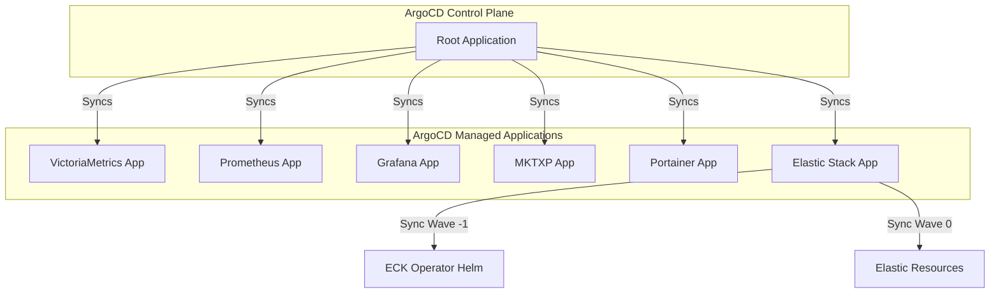

# Monitoring Stack

A comprehensive, GitOps-ready monitoring and observability solution providing two primary stacks: a lightweight **VictoriaMetrics + Prometheus** stack for metrics, and a full **Elastic Stack (ECK)** for logs, APM, and advanced telemetry.

## 🏗️ Architecture & Data Flows

### 1. Core Monitoring Stack (Metrics)
This stack focuses on high-performance time-series data using VictoriaMetrics as the storage backbone.

### 2. Elastic Stack (Logs, APM, OTel)
Managed by the **Elastic Cloud on Kubernetes (ECK) Operator**, this stack provides deep observability.

### 3. GitOps Deployment (ArgoCD)
The entire infrastructure is managed via an "App of Apps" pattern in ArgoCD.

---

## 🚀 Deployment Overview

### GitOps Strategy (ArgoCD)
The deployment follows a strictly declarative approach using **ArgoCD**.
- **Root Application**: Points to `k8s/argocd/apps`, which contains individual `Application` manifests for every component.
- **Sync Waves**: Used to ensure dependencies are met (e.g., the ECK Operator is installed before the Elasticsearch cluster).
- **Namespacing**: 
  - `monitoring`: VictoriaMetrics, Prometheus, Grafana, MKTXP.
  - `elastic-system`: ECK Operator, Elasticsearch, Kibana, Fleet, Agents.
  - `argocd`: ArgoCD itself.

### Local Development (Docker)
A `docker-compose.yml` is provided for rapid local testing of the core monitoring stack (VictoriaMetrics, Prometheus, Grafana, MKTXP).

---

## 🛠️ Technical Implementation Details

### VictoriaMetrics & Prometheus Stack
- **VictoriaMetrics Cluster**: Deployed as a distributed system with separate `vmstorage` (stateful), `vminsert` (stateless ingestion), and `vmselect` (stateless query) components.
- **Prometheus**: Configured as a "stateless scraper". It does not store data locally but uses `remote_write` to push all metrics to VictoriaMetrics.
- **MKTXP**: A specialized exporter for MikroTik. In Kubernetes, it uses a template-based `ConfigMap` and `Secret` to dynamically generate its configuration with router credentials.
- **Grafana Provisioning**: Dashboards and Datasources are automatically provisioned via Kubernetes `ConfigMaps`, ensuring the UI is ready immediately after deployment.

### Elastic Stack (ECK)
- **Operator-Based**: Uses the ECK Operator to manage the lifecycle of Elasticsearch and Kibana.
- **Fleet Management**: Implements Elastic Fleet for centralized agent management.
- **OTel Integration**: Includes an OpenTelemetry (OTel) Collector agent configured via Fleet to receive OTLP data. A dedicated traffic generator (`otel-generator`) is included to simulate real-world telemetry.
- **Synthetics**: Deployed with an Elastic Synthetics agent for pro-active uptime and performance monitoring.

### Local macOS Monitoring
The `vmagent` directory contains a specialized setup for macOS:
- `install.sh`: Automated script to set up `node_exporter` and `vmagent`.
- `vmagent`: Acting as a lightweight scraper on the host, pushing metrics to the central VictoriaMetrics cluster via the remote-write API.

---

## 📋 Port Reference Table

| Component | Port | Namespace | Description |
| :--- | :--- | :--- | :--- |
| **Grafana** | 3000 | monitoring | Visualization UI |
| **VictoriaMetrics Insert** | 8480 | monitoring | Data Ingestion API |
| **VictoriaMetrics Select** | 8481 | monitoring | Query API (PromQL compatible) |
| **Prometheus** | 9090 | monitoring | Scraper UI |
| **Kibana** | 5601 | elastic-system | Elastic UI (LoadBalancer) |
| **Elasticsearch** | 9200 | elastic-system | Search & Analytics API |
| **Fleet Server** | 8220 | elastic-system | Agent Management |
| **OTel Collector** | 8200 | elastic-system | OTLP Ingestion |
| **Portainer** | 9000 | monitoring | K8s Management UI |
| **MKTXP** | 49090 | monitoring | MikroTik Metrics |

---

## ⚙️ Configuration Files
- `k8s/argocd/root-application.yaml`: The entry point for the entire deployment.
- `k8s/prometheus/prometheus-config.yaml`: Scrape jobs for Kubernetes and exporters.
- `k8s/elastic-stack/deploy/elastic-stack.yaml`: Definitions for ES, Kibana, and Fleet.
- `docker/mktxp/mktxp.conf`: Configuration template for MikroTik metrics.
